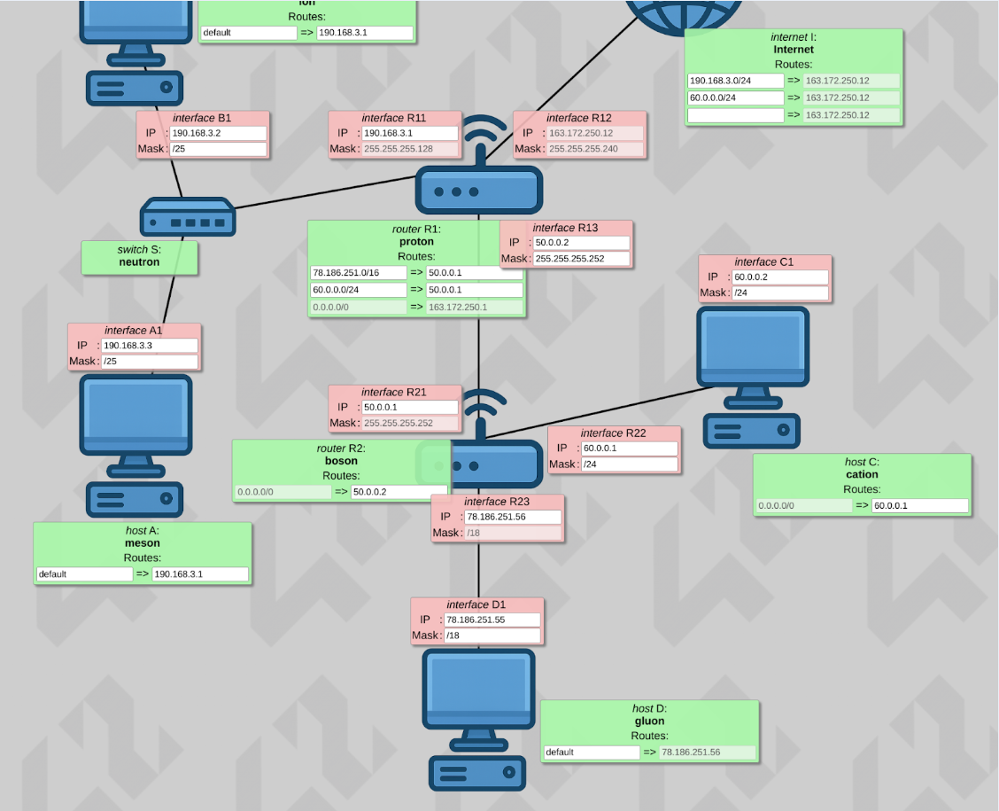

# netpractice
   
   ## Máscaras de Red / Subneting
   
   

   ## Índice de Ejercicios

- [Level 1](#level-1)
- [Level 2](#level-2)
- [Level 3](#level-3)
- [Level 4](#level-4)
- [Level 5](#level-5)
- [Level 6](#level-6)
- [Level 7](#level-7)
- [Level 8](#level-8)
- [Level 9](#level-9)
- [Level 10](#level-10)

## Level 1

Tenemos que poner las IPs de la interfaz D1 y A1, en dos redes diferentes. D1 pertenece a una red con máscara /16 (clase B 255.255.0.0), por lo que solo es necesario que coincidan las Ips de los dos primeros octetos (211.191). En los dos siguientes podemos elegir cualquier valor entre 0-255, descartando el 0 que es el valor de red y el 255, que es el de broadcast. 

En la otra red la máscara es /24 (clase C 255.255.255.0), tienen que coincidir los valores de los 3 primeros octetos (104.95.23) y en el último elegimos cualquier valor entre 0-255 descartando primero y último.

## Level 2

Descripción del ejercicio...

## Level 3

## Level 4

## Level 5

## Level 6

## Level 7

## Level 8

En este esquema nos dan el destino de la ruta de internet con máscara /26 y en R2 nos dan la puerta de enlace (PE) de la ruta default con una IP de ese mismo rango de red. Hago subneting en dicho rango y es necesario usar máscara /28 para que no haya solapamiento. 

En la interfaz R13 estamos obligados a poner la IP 161.246.151.62 que es la PE de la ruta del router R2. Aquí la duda puede ser qué máscara utilizar. Si pusiéramos máscara /26 (64 IPs, rango 0-63), las IPs de R13 y R21 (62 y 61) estarían en el mismo rango que las interfaces R22 y R23 (17 y 1), produciendo solapamiento de redes. 

Por tanto es necesario /28 (16 IPs por subred). Con esta máscara las IPs de R13 y R21 (62 y 61) están en la subred 48-63 y no se produce solapamiento con las otras subredes: 0-15 y 16-31.

## Level 9

En este esquema no hago subneting, utilizo rangos de red diferentes para cada tramo. Hay muy pocos valores que nos dan predeterminados, y para mi la dificultad mayor es que esta libertad de elección de rutas me hizo por concepto y por costumbre utilizar redes privadas, cuando no podemos al no ser esquemas con NAT (Network Address Translation, que traduce direcciones privadas a públicas para salir a Internet).

**Punto clave - Redes públicas vs privadas:**
Como no hay NAT , no podemos utilizar redes privadas (10.0.0.0/8, 172.16.0.0/12, 192.168.0.0/16), ya que Internet no enruta tráfico a estas direcciones. Por tanto, uso rangos públicos similares a los privados:
- 192.168.3.x → 190.168.3.x
- 10.0.0.x → 50.0.0.x y 60.0.0.x

**Configuración de rutas:**
- En R1: Añado rutas para llegar a cation y gluon (ambos hosts internos).
- En Internet: Solo añado rutas hacia cation y meson, que son los hosts que necesitan acceso a Internet. Gluon no necesita acceso a Internet, por lo que no es necesario que Internet tenga una ruta hacia él.

**Nota importante:** Esto no sería realista en un entorno real, ya que Internet no tendría rutas específicas hacia hosts internos. En la práctica, esto  se resolvería con NAT y redes privadas.

## Level 10

En este nivel dan muchos valores predeterminados y sí realizo subneting. 

**Restricción clave - Ruta única en Internet:**
En Internet solo puedo añadir una ruta, por eso uso el rango 153.223.108.0 con máscara /24 para que alcance todas las subredes del esquema.

**Análisis del espacio de direcciones (153.223.108.0/24):**
Los valores predeterminados ya ocupan gran parte del espacio:
- /25 (H21-H11): IPs 0-127 (128 direcciones)
- /26 (R23-H41): IPs 128-191 (64 direcciones)
- Espacio disponible: 192-255

**Solución para R22-H31:**
La única dificultad es elegir la máscara para las interfaces R22 y H31, donde no hay valores predeterminados. Si pusiera /28 (16 IPs) no controlo bien si hay solapamiento con el rango 192-255, por eso elijo /30 (4 IPs) que me da mayor control.

Uso las IPs 249 y 250, que están en el rango justo anterior a las IPs 251-254 que son usadas para la comunicación entre routers R1 y R2, con máscara /30, y son predeterminadas. Con /30 tengo subredes de 4 IPs cada una, y descartando la primera (red) y la última (broadcast), puedo asignar las dos del medio sin solapamiento.

Esta solución funciona sin necesidad de cálculos complejos y evita conflictos entre subredes.
