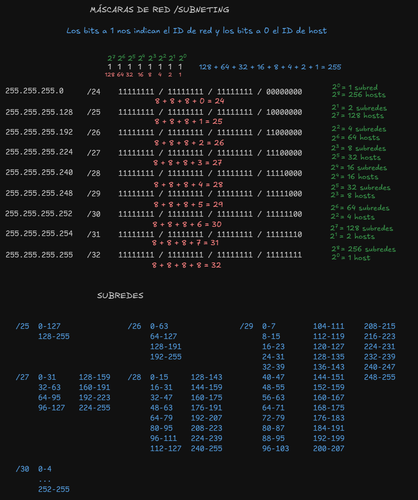
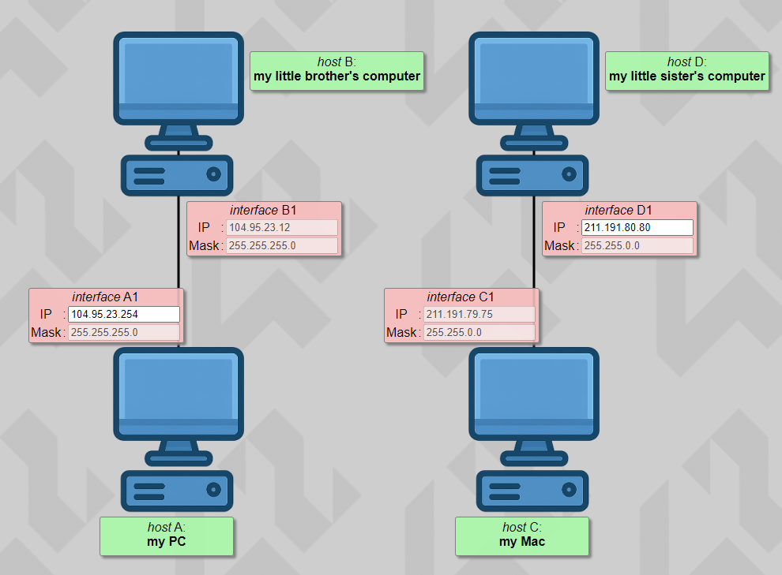
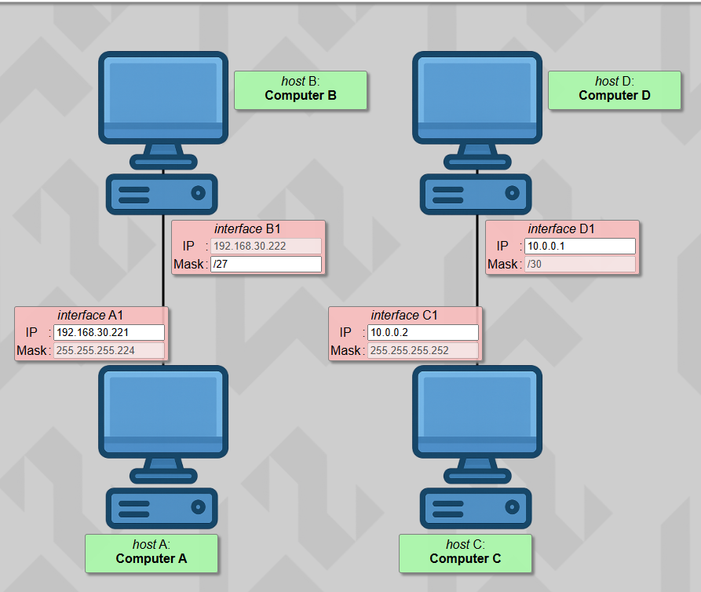
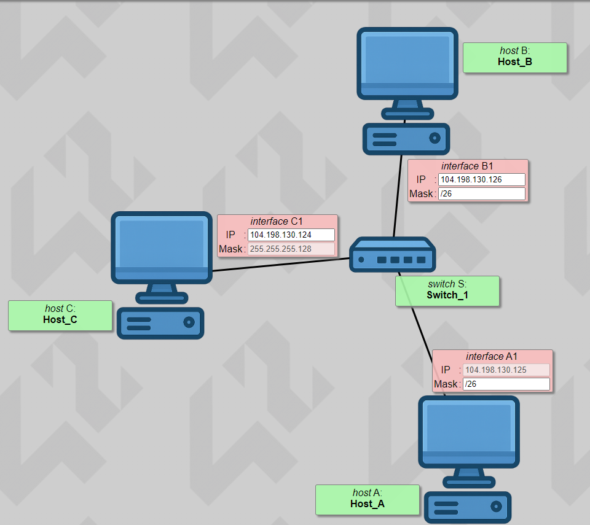
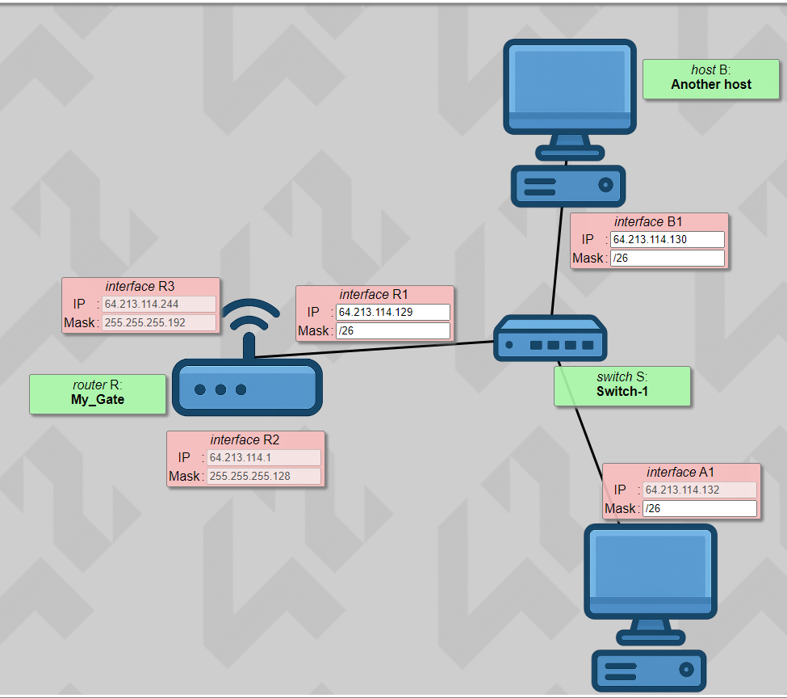
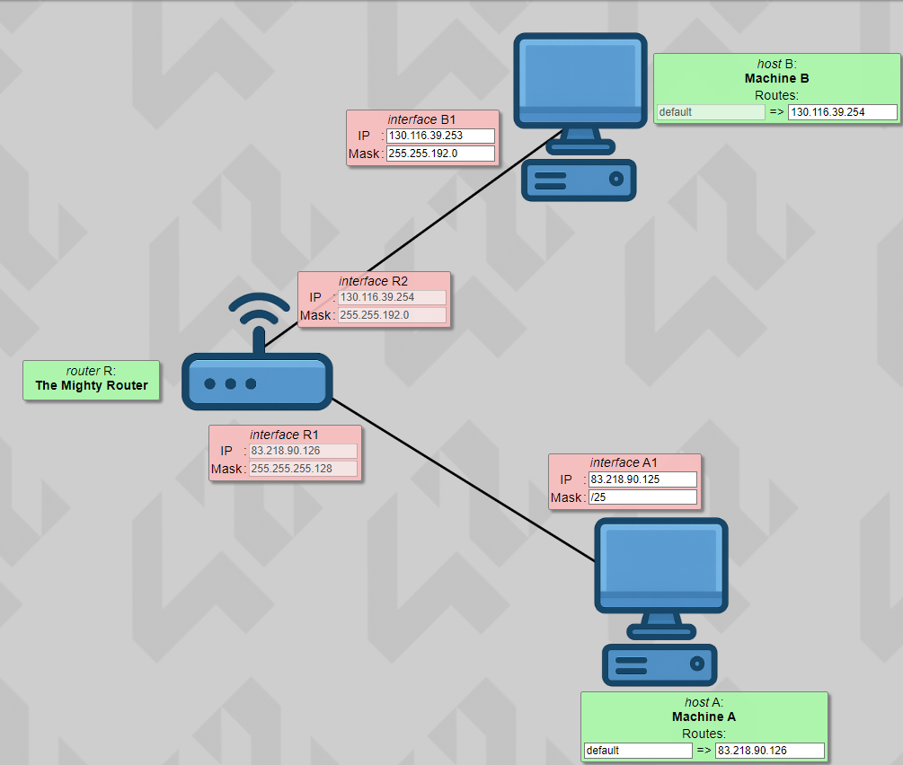
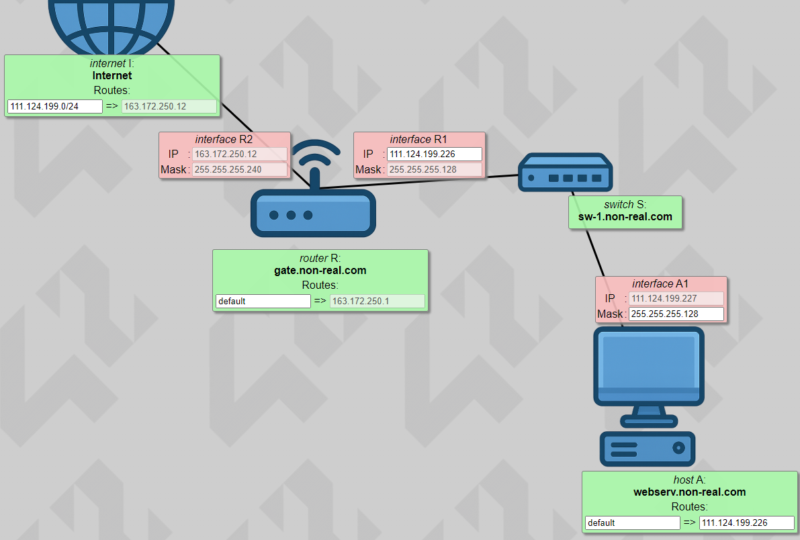
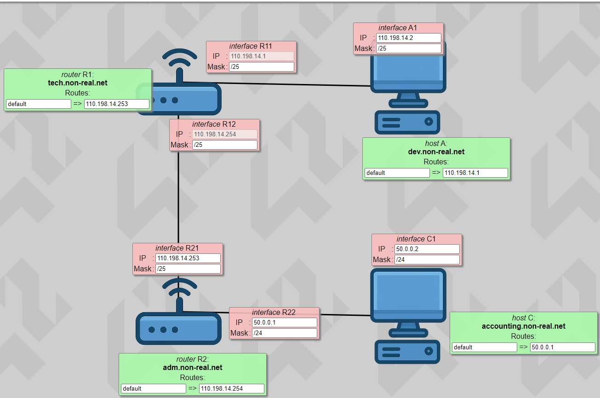
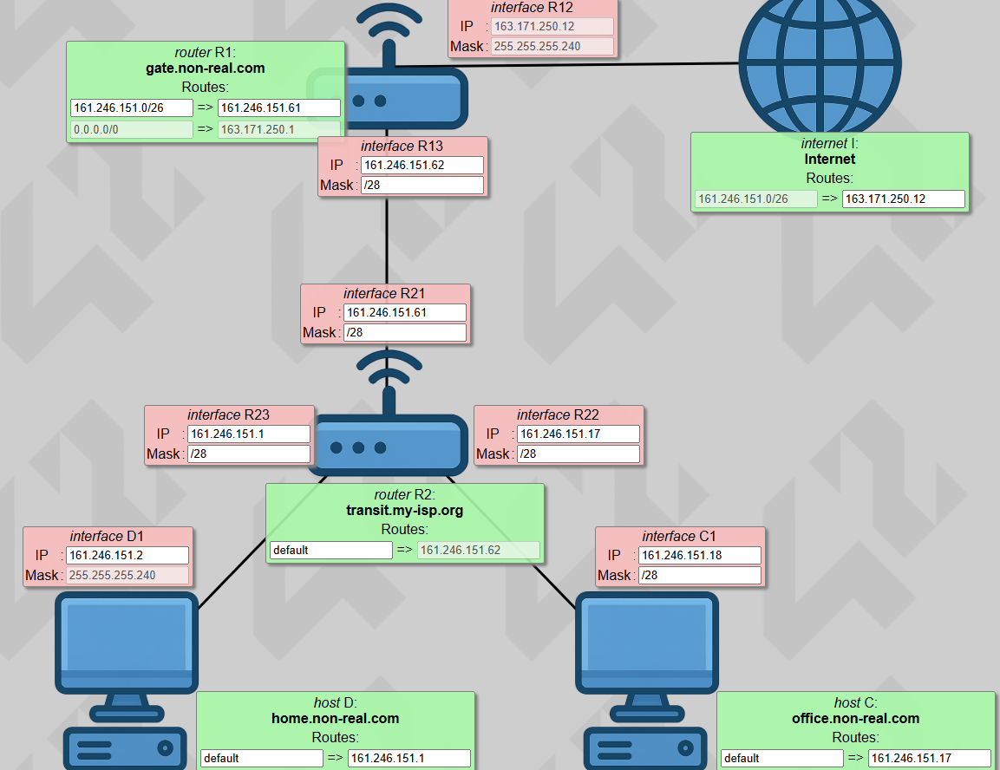
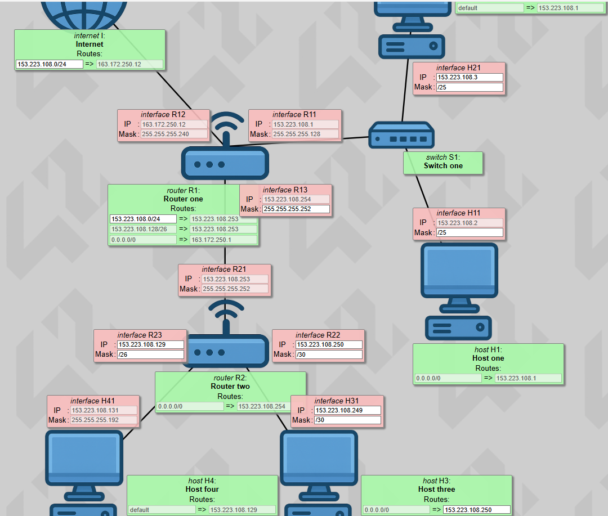

# netpractice
   
   ## Máscaras de Red / Subneting
   
   

   ## Índice de Ejercicios

- [Level 1](#level-1)
- [Level 2](#level-2)
- [Level 3](#level-3)
- [Level 4](#level-4)
- [Level 5](#level-5)
- [Level 6](#level-6)
- [Level 7](#level-7)
- [Level 8](#level-8)
- [Level 9](#level-9)
- [Level 10](#level-10)

## Level 1

Descripción del ejercicio...

## Level 2

Descripción del ejercicio...

## Level 3

## Level 4

Descripción del ejercicio...

## Level 5

Descripción del ejercicio...

## Level 6

## Level 7

Descripción del ejercicio...

## Level 8

Descripción del ejercicio...

## Level 9

## Level 10

